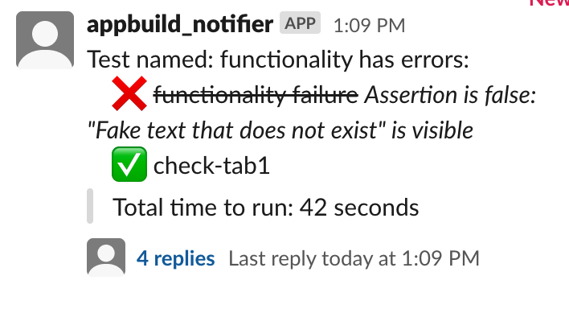
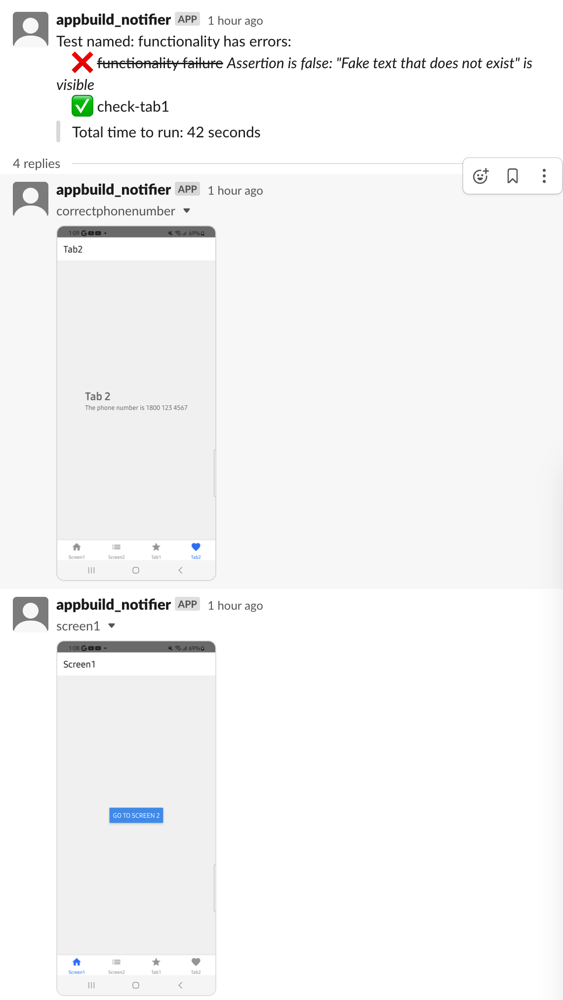

This package was sponsored by Rocket Lab Ltd.
Give them a check out here if you have Application development needs: https://www.rocketlab.com.au/

## Examples
### A passing, and failing test:


### Images being added to the original test results thread:


### All tests passing, abbrievated result:


# Maestro test parser

This action will look for test results in a given folder, and then parse them into a string that can be sent to slack. 
After parsing tests, it will look for any pictures or videos that were generated during the test run, and upload them to slack as well.

Sending a message to your slack instance requires a slack token and channel ID.
It also requires the bot to have chat:write permissions. 
It uses the following api call:
https://api.slack.com/methods/chat.postMessage

Uploading files requires the files.write permission scope. For more information checkout: https://api.slack.com/scopes/files:write

The typical workflow is to check for a test file, and if we get results from there then check for pictures or videos to upload, and attach them to the initial message that has the test results on slack.


# What is Maestro?
Maestro Studio is a testing suite that will run a mobile phone as if it is a user, with a simple to use YAML syntax along with a visual UI to help you choose what interactions to do on a screen. It is a step forward in making easy to make, reproducible end to end tests. Check it out at https://maestro.mobile.dev/

## ENV variables 

### `SLACK_TOKEN`

**Required**
The Slack token with permissions to post to the channel - starts with xoxb- 
For more information checkout: https://api.slack.com/tutorials/tracks/getting-a-token

### `SLACK_CHANNEL`

**Required**
The channel ID of the place you want to post in - you can get this easily by visiting the channel in a browser and copying the last part of the URL (will be in Capitals)

### `INTRO_MESSAGE`

Optional
The string provided here will be prepended to the start of the test results (with a line break added).


## Example usage

```yaml
- name: Parse maestro tests and send results to slack
        id: test-results
        uses: brett-james-rocketlab/maestro-test-results-to-slack@main
        env:
          SLACK_CHANNEL: ${{ secrets.SLACK_CHANNEL }}
          SLACK_TOKEN: ${{ secrets.SLACK_TOKEN }}
```
The above will look in the checked out project's root folder for looking for your junit test xml file, and images.

Or if you have a test folder you have previously generated and want to use, add the TEST_RESULTS_FOLDER env variable.
In the example below, it would be assumed that inside the projects root folder, we then look in the MaestroTests/TestResults folder for the test results, and pictures to send.

```yaml
- name: Parse maestro tests and send results to slack
        id: test-results
        uses: brett-james-rocketlab/maestro-test-results-to-slack@main
        env:
          SLACK_CHANNEL: ${{ secrets.SLACK_CHANNEL }}
          SLACK_TOKEN: ${{ secrets.SLACK_TOKEN }}
          TEST_RESULTS_FOLDER: MaestroTests/TestResults/
```

## Typical workflow

You will want to setup your project before this, and either build your application, or have an APK ready to go that is sent to this and triggers this action.

Once you have done that, you will want to run your tests. Try them out locally first to confirm you are okay, then this command will be what you need:
```
maestro test --format junit --output MaestroTests/TestResults/report.xml MaestroTests/autorun
```
Explanation: This will run a test on all files that are in a given folder 
(MaestroTests/autorun), and output a junit xml test result to the folder above as well. The file name isn't important.

You can have one or many test files in the folder. You can read about this with their documentation here: https://maestro.mobile.dev/cli/test-suites-and-reports

The folder names above are related to the `TEST_RESULTS_FOLDER` you have set in the action.

I recommend that you set  `continue-on-error: true` on the test runner step's YAML. This is because a failed test would halt running your CI, which would mean you would only see passing tests.

